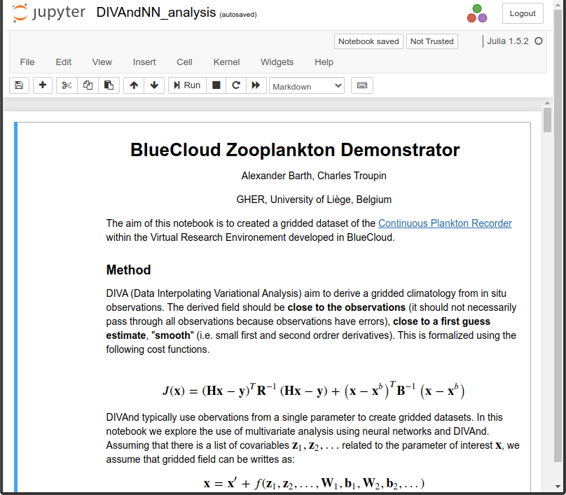

# Interpolation of zooplankton data using the inverse methods DIVAnd and neural networks

The aim of this notebook is to create a gridded data set of the
[Continuous Plankton Recorder](https://www.cprsurvey.org/services/the-continuous-plankton-recorder/) within the Virtual Research Environment developed in BlueCloud.

## Input data

Data from the continuous plankton recorder operated by the Marine Biological Association, UK is used as input data for this exercise.

Other sources of information are used to improve the interpolation ("co-variables"), namely:

 * Sea water temperature (SeaDataCloud)
 * Salinity (SeaDataCloud)
 * Distance from coast (NASA Goddard Space Flight Center)
 * Bathymetry (GEBCO)
 * Nitrate, Silicate and Phosphate (World Ocean Atlas 2018)

The URLs of all these resources are available in the notebook `DIVAndNN_analysis.ipynb`.
All input data are downloaded and imported automatically when the notebook is executed.

## Software requirements

The notebook needs Julia 1.5 or later (already preinstalled on BlueCloud). Additional Julia software packages are installed automatically if they are not present.
The notebooks have been developed on Julia 1.6 and the versions of all software dependencies are saved in the file `Manifest.toml`.
Per default, Julia inside Jupyter environment will use the same versions (more information on [julia notebook](https://julialang.github.io/IJulia.jl/stable/manual/usage/#Julia-projects) and on [instantiating a julia environment](https://julialang.github.io/Pkg.jl/v1/environments/)) in order to enhance reproducibility of results.

## Running the notebook

This data product uses two jupyter notebooks:

 1. `DIVAndNN_analysis.ipynb` executing the following steps:
     * Install required Julia packages (if necessary)
     * Download the data
     * Preparation of co-variables
     * Split data into training and validation data set
     * Execute DIVAnd with the neural network analysis
     * Results in form of NetCDF files are stored in `BlueCloud-data/results` directly under your home directory. The last message of the notebook shows the precise location where the files are saved.

 2. `DIVAndNN_plot_res.ipynb` executing the following steps:
     * Visualization of the results
     * Figures (PNG files) are stored in `BlueCloud-data/figures` directly under your home directory. The last message of the notebook shows the precise location where the figures are saved.
     * The figures are also presented directly on your notebook.

You can only run the notebook `DIVAndNN_plot_res.ipynb` only after `DIVAndNN_analysis.ipynb` is finished.
Your home directory is a temporary storage on BlueCloud. Consider copying the files to a permanent storage like your BlueCloud workspace.

Documentation on the jupyter lab user interface is [available here](https://jupyterlab.readthedocs.io/en/latest/).

These notebooks are developed by the GHER, University of Liege, Belgium and released under the terms of the GPL version 2 (or later, at your option).
